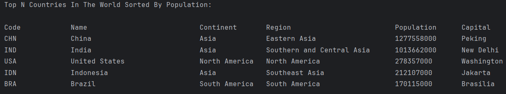

# SET08803 Coursework Group 1

* Master Build Status 
* Develop Branch Status 
* License 
* Release 
* Code Coverage 
* Code Coverage Graph
  https://codecov.io/gh/Calixte-Williams/set08803_gw/graphs/sunburst.svg?token=VYZ5G3UOCX

## Group Members
- Calixte Williams
- Desiree Jn. Baptiste
- Terrel Deligny
- Jermon Ephraim
- Shahidi Leonce

## Kanban Board
Kanban #1: GitHub Projects
- https://github.com/users/Calixte-Williams/projects/2

Kanban #2: Zube.io
- https://zube.io/napier-343/population-reporting-set08803/w/workspace-1/kanban

## Requirements Met Tracker

| ID | Name                                                                                                  | Met | Screenshot                                                                   |
|----|-------------------------------------------------------------------------------------------------------|-----|------------------------------------------------------------------------------|
| 1  | All the countries in the world organised by largest population to smallest.                           | Yes |  |
| 2  | All the countries in a continent organised by largest population to smallest.                         | Yes |       |
| 3  | All the countries in a region organised by largest population to smallest.                            | Yes |                      |
| 4  | The top N populated countries in the world where N is provided by the user.                           | Yes |                      |
| 5  | The top N populated countries in a continent where N is provided by the user.                         | Yes |         |
| 6  | The top N populated countries in a region where N is provided by the user.                            | Yes |             |
| 7  | All the cities in the world organised by largest population to smallest.                              | Yes |                          |
| 8  | All the cities in a continent organised by largest population to smallest.                            | Yes |                 |
| 9  | All the cities in a region organised by largest population to smallest.                               | Yes |                  |
| 10 | All the cities in a country organised by largest population to smallest.                              | Yes |                    |
| 11 | All the cities in a district organised by largest population to smallest.                             | Yes |                 |
| 12 | The top N populated cities in the world where N is provided by the user.                              | Yes |                         |
| 13 | The top N populated cities in a continent where N is provided by the user.                            | Yes |         |
| 14 | The top N populated cities in a region where N is provided by the user.                               | Yes |            |
| 15 | The top N populated cities in a country where N is provided by the user.                              | Yes |             |
| 16 | The top N populated cities in a district where N is provided by the user.                             | Yes |           |
| 17 | All the capital cities in the world organised by largest population to smallest.                      | Yes |                |
| 18 | All the capital cities in a continent organised by largest population to smallest.                    | Yes |   |
| 19 | All the capital cities in a region organised by largest to smallest.                                  | Yes |           |
| 20 | The top N populated capital cities in the world where N is provided by the user.                      | Yes |                 |
| 21 | The top N populated capital cities in a continent where N is provided by the user.                    | Yes |         |
| 22 | The top N populated capital cities in a region where N is provided by the user.                       | Yes |            |
| 23 | The population of people, people living in cities, and people not living in cities in each continent. | Yes |            |
| 24 | The population of people, people living in cities, and people not living in cities in each region.    | Yes |                 |
| 25 | The population of people, people living in cities, and people not living in cities in each country.   | Yes |                 |
| 26 | The population of the world.                                                                          | Yes |                   |
| 27 | The population of a continent.                                                                        | Yes |               |
| 28 | The population of a region.                                                                           | Yes |                  |
| 29 | The population of a country.                                                                          | Yes |                 |
| 30 | The population of a district.                                                                         | Yes |                |
| 31 | The population of a city.                                                                             | Yes |                    |
| 32 | The Total number of Speakers per language.                                                            | Yes |             |
